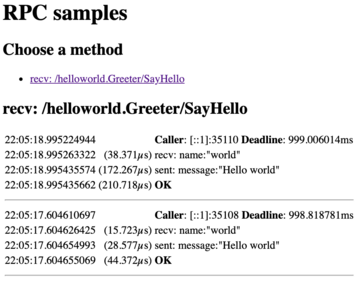

# rpcz

[](https://godoc.org/github.com/Jille/rpcz)

This library shows recent gRPC calls on a web page including their payloads for debugging.

You need to register interceptors for every gRPC client and server that you want to debug.

```go
// Servers
s := grpc.NewServer(grpc.ChainUnaryInterceptor(UnaryServerInterceptor), grpc.ChainStreamInterceptor(StreamServerInterceptor))

// Clients
c, err := grpc.Dial(addr, grpc.WithUnaryInterceptor(rpcz.UnaryClientInterceptor), grpc.WithStreamInterceptor(rpcz.StreamClientInterceptor))

// Expose the debugging page. Make sure to protect it appropriately, as it exposes all RPC payloads.
http.Handle("/rpcz", httpauth.SimpleBasicAuth("debugger", "hackme")(rpcz.Handler))
```

Allow me to reiterate: It is very important to protect the rpcz.Handler against unprivileged access if you don't want a data leak.

## Screenshot


